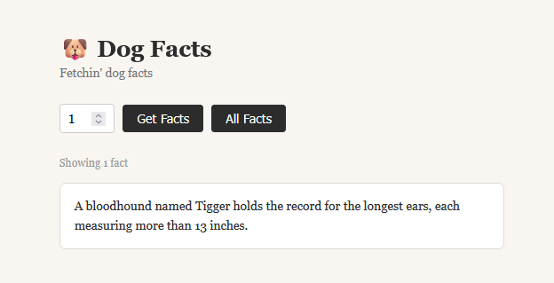

# Dog Facts API 



> *Fetchin' dog facts*

A simple REST API and front end that serves dog facts, built with Node.js and Express.

---

## Setup

Clone the repo and install dependencies:

```bash
git clone https://https://github.com/givecoffee/AD311/new/main/dog-facts-api.git
cd dog-facts-api
npm install
